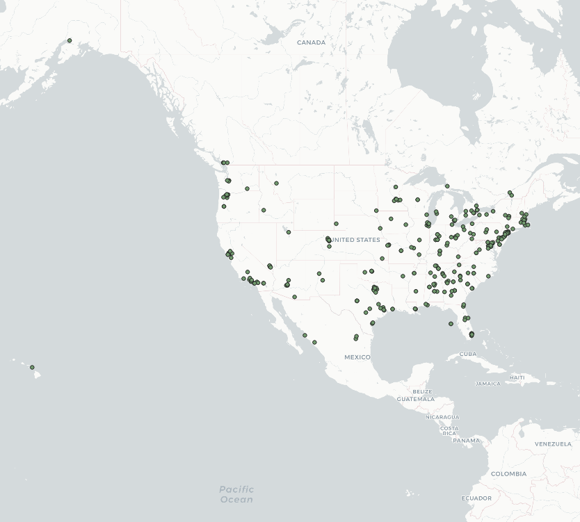

# lab2

This map plots data of of trending tweets with the word Coronavirus hotspot within the United States. When looking at this map it is intresting to see that a lot of the hot spots for tweets with the word Coronavirus, are the areas that have hot spots of Covid. These areas are also where larger cities and populations tend to be. You see many plots around the Seattle area, souther California (refrencing LA probably), and of course the NY area.

It is super intresting to see this visualization because it makes you think of the role not only social media plays in certain trending topics but also the media. Why were we talking about Covid so much more in highly reported areas versus not. Is Covid really a big deal in this area or is social media and the news exagerating things for viewership?
